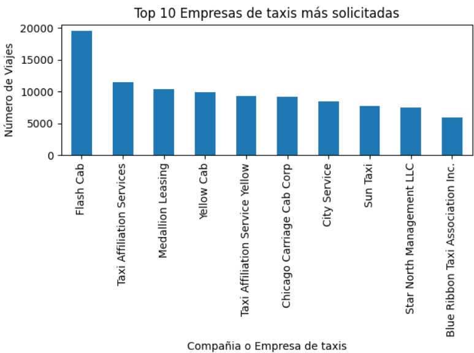
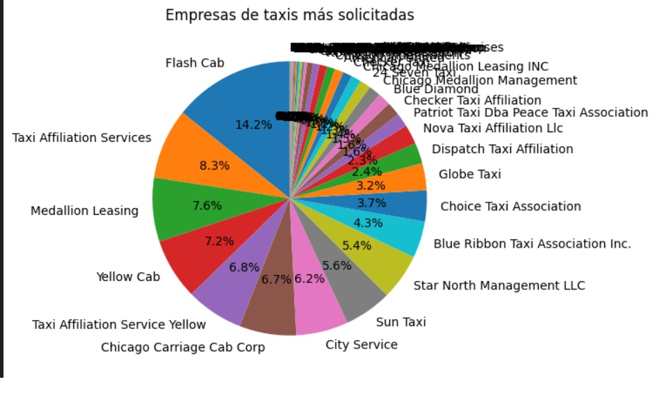

🚖🌧️ Zuber – Análisis de Demanda y Clima

📌 Contexto
Proyecto de análisis exploratorio para Zuber, empresa de viajes compartidos en Chicago.
Se analizaron datos de viajes para comprender: Zonas con mayor demanda, Empresas más activas e Impacto del clima en la duración de los viajes
📁 Datasets: project_sql_result_01.csv, project_sql_result_07.csv, project_sql_result_04.csv

🎯 Objetivo
Identificar patrones en los datos que permitan:
  Detectar barrios con mayor número de finalizaciones
  Determinar qué compañías concentran más viajes
  Evaluar si el clima impacta significativamente en la duración de los viajes

💻 Procesamiento de datos 
Análisis con SQL y Python de viajes por empresa y barrio
Identificación de zonas con mayor demanda
Evaluación del impacto del clima en trayectos Loop → O’Hare
Pruebas estadísticas: Prueba de Levene, Prueba t de Student 
Visualizaciones para comunicar hallazgos clave

🔎 Principales Hallazgos
🗺️ Zonas con Mayor Demanda
🚕 Empresas Más Activas
🌧️☀️ Impacto del Clima en la Duración y Demanda de viajes 
Trayecto analizado: Loop → Aeropuerto O’Hare

📊 Insights Estratégicos
Mayor concentración operativa en zonas centrales
Flash Cab es el principal competidor
El clima debe considerarse en: Planificación operativa, Estimación de tiempos y Estrategias de precios dinámicos

📈 Algunas Visualizaciones

  

